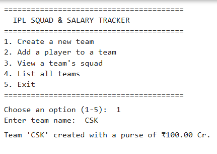

#  Test Cases – IPL Squad & Salary Tracker

## Overview

This document summarizes the primary functional test cases performed to validate the IPL Squad & Salary Tracker application.

---

## Test Environment

| Item | Details |
|------|---------|
| Language | Python 3.x |
| Interface | Command Line Interface (CLI) |
| IDE | Visual Studio Code |
| External Libraries | None |

---

# Test Case Summary

| Test ID | Scenario | Status |
|----------|----------|--------|
| TC-001 | Create a new team | ✅ Passed |
| TC-002 | Add player to a team | ✅ Passed |
| TC-003 | View team squad | ✅ Passed |
| TC-004 | Purse limit validation | ✅ Passed |
| TC-005 | Invalid input handling | ✅ Passed |

---

# TC-001 – Create a New Team

**Objective**

Verify that a new team is created with the default purse.

| Input | Expected Result | Status |
|-------|-----------------|--------|
| Chennai Super Kings | Team created with ₹100 Cr purse | ✅ Passed |

**Screenshot**

<p align="center">
  
</p>

# TC-002 – Add Player Successfully

**Objective**

Verify that a player is added successfully and the purse is updated.

| Input | Expected Result | Status |
|-------|-----------------|--------|
| MS Dhoni (₹12 Cr) | Player added and purse reduced to ₹88 Cr | ✅ Passed |

📷 **Screenshot**

```text
docs/Screenshots/add_player.png
```

---

# TC-003 – View Squad

**Objective**

Verify that the application correctly displays squad details.

| Expected Result | Status |
|-----------------|--------|
| Player list, total spent, average spending, and remaining purse displayed correctly | ✅ Passed |

📷 **Screenshot**

```text
docs/Screenshots/view_squad.png
```

---

# TC-004 – Purse Limit Validation

**Objective**

Ensure that players cannot be purchased if their price exceeds the remaining purse.

| Input | Expected Result | Status |
|-------|-----------------|--------|
| Remaining Purse: ₹5 Cr<br>Player Price: ₹15 Cr | Purchase rejected with warning message | ✅ Passed |

📷 **Screenshot**

```text
docs/Screenshots/purse_limit.png
```

---

# TC-005 – Invalid Input Handling

**Objective**

Verify that invalid user inputs are handled gracefully.

| Scenario | Expected Result | Status |
|----------|-----------------|--------|
| Invalid menu option or non-numeric price | Appropriate error message displayed | ✅ Passed |

📷 **Screenshot**

```text
docs/Screenshots/invalid_input.png
```

---

# Test Summary

| Metric | Result |
|--------|-------:|
| Total Test Cases | 5 |
| Passed | 5 |
| Failed | 0 |
| Success Rate | **100%** |

---

## Conclusion

The application successfully passed all major functional test cases. Testing confirmed that the system correctly manages team creation, player additions, purse calculations, squad summaries, and user input validation, ensuring reliable operation under normal usage.
