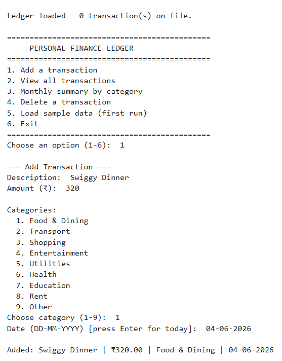
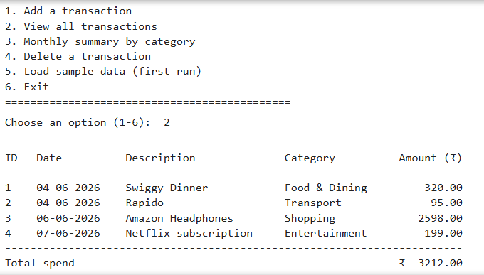
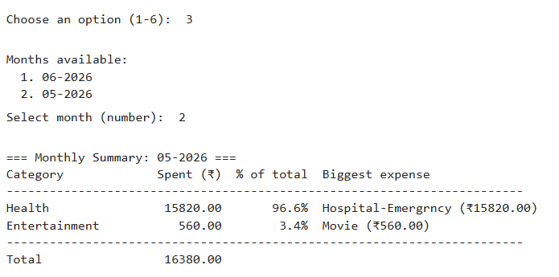
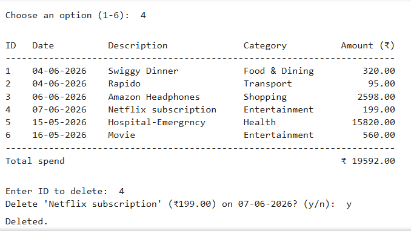
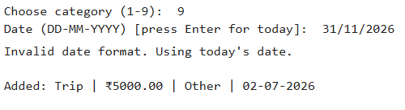

#  Test Cases – Personal Finance Ledger

## Overview

This document summarizes the primary functional test cases performed to validate the **Personal Finance Ledger** application.

---

## Test Environment

| Item | Details |
|------|---------|
| Language | Python 3.x |
| Interface | Command Line Interface (CLI) |
| IDE | Visual Studio Code |
| Data Storage | JSON File (`ledger.json`) |
| External Libraries | None |

---

# Test Case Summary

| Test ID | Scenario | Status |
|----------|----------|--------|
| TC-001 | Add a new transaction | ✅ Passed |
| TC-002 | View all transactions | ✅ Passed |
| TC-003 | Generate monthly summary | ✅ Passed |
| TC-004 | Delete a transaction | ✅ Passed |
| TC-005 | Invalid input handling | ✅ Passed |

---

# TC-001 – Add a New Transaction

**Objective**

Verify that a new expense transaction is successfully added and saved to the ledger.

| Input | Expected Result | Status |
|-------|-----------------|--------|
| Description: Swiggy Dinner Amount: ₹320 Category: Food & Dining | Transaction added and stored in `ledger.json` | ✅ Passed |

### Screenshot

  

---

# TC-002 – View All Transactions

**Objective**

Verify that all saved transactions are displayed with correct details.

| Expected Result | Status |
|-----------------|--------|
| Transaction ID, Date, Description, Category, Amount and Total Spend displayed correctly | ✅ Passed |

### Screenshot

  

---

# TC-003 – Monthly Summary

**Objective**

Verify that the application generates an accurate monthly expense summary grouped by category.

| Expected Result | Status |
|-----------------|--------|
| Monthly total, category-wise spending, percentage contribution and biggest expense displayed correctly | ✅ Passed |

### Screenshot

  

---

# TC-004 – Delete Transaction

**Objective**

Verify that an existing transaction can be deleted after user confirmation.

| Input | Expected Result | Status |
|-------|-----------------|--------|
| Delete Transaction ID: 3 | Transaction removed and ledger updated | ✅ Passed |

### Screenshot

  

---

# TC-005 – Invalid Input Handling

**Objective**

Verify that invalid user inputs are handled without crashing the application.

| Scenario | Expected Result | Status |
|----------|-----------------|--------|
| Invalid menu option, invalid amount, invalid category or incorrect date format | Appropriate validation message displayed and application continues normally | ✅ Passed |

### Screenshot

  

---

# Test Summary

| Metric | Result |
|--------|-------:|
| Total Test Cases | 5 |
| Passed | 5 |
| Failed | 0 |
| Success Rate | **100%** |

---

## Conclusion

The **Personal Finance Ledger** successfully passed all major functional test cases. Testing verified that the application correctly records expenses, persists data in a JSON file, generates monthly spending summaries, supports transaction deletion, and validates user inputs to ensure reliable and consistent operation.
