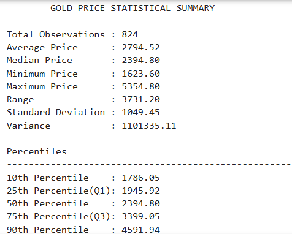
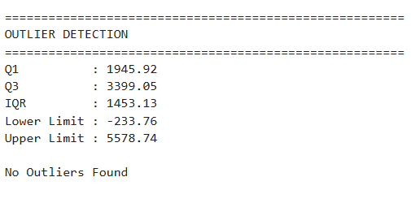
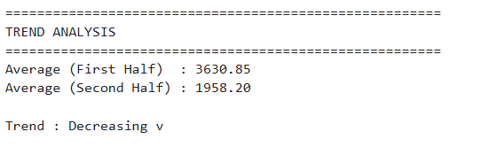
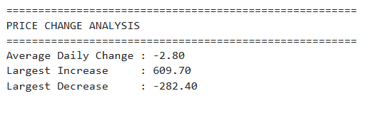
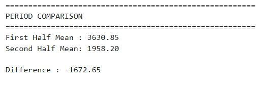
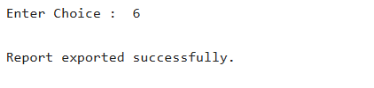

#  Test Cases – Gold Price Analysis Engine

## Overview

This document summarizes the primary functional test cases performed to validate the **Gold Price Analysis Engine**. The application analyzes historical gold prices using NumPy to generate descriptive statistics, detect outliers, compare trends, and export analytical reports.

---

## Test Environment

| Item | Details |
|------|---------|
| Language | Python 3.x |
| Interface | Command Line Interface (CLI) |
| IDE | Visual Studio Code |
| Dataset | Gold Futures Historical Data (.csv) |
| Libraries | NumPy, Pandas |

---

# Test Case Summary

| Test ID | Scenario | Status |
|----------|----------|--------|
| TC-001 |Generate Statistical Summary | ✅ Passed |
| TC-002 | Detect Outliers using IQR | ✅ Passed |
| TC-003 | Trend Analysis | ✅ Passed |
| TC-004 | Daily Price Change | ✅ Passed |
| TC-005 | Compare two trend | ✅ Passed |
| TC-006 | Export Analysis Report | ✅ Passed |

---

# TC-001 – Generate Statistical Summary

**Objective**

Verify that the application correctly computes descriptive statistics for the gold price dataset.

| Input | Expected Result | Status |
|-------|-----------------|--------|
| Menu Option: **1** | Mean, Median, Min, Max, Range, Standard Deviation, Variance and Percentiles displayed correctly | ✅ Passed |

### Screenshot

  

---

# TC-002 – Detect Outliers using IQR

**Objective**

Verify that the application correctly identifies potential outliers using the Interquartile Range (IQR) method.

| Input | Expected Result | Status |
|-------|-----------------|--------|
| Menu Option: **2** | Q1, Q3, IQR, lower limit, upper limit and detected outliers displayed correctly | ✅ Passed |

### Screenshot

  

---

# TC-003 – Trend Analysis

**Objective**

Verify that the application compares the average prices of two time periods using NumPy array slicing.

| Input | Expected Result | Status |
|-------|-----------------|--------|
| Menu Option: **3** | Shows the average trend over first and second half | ✅ Passed |

### Screenshot

  

---

# TC-004 – Daily Price Change

**Objective**

Verify that the application successfully displays the daily price change.

| Input | Expected Result | Status |
|-------|-----------------|--------|
| Menu Option: **4** | Shows the average of daily price change | ✅ Passed |

### Screenshot

  

---

# TC-005 - Compare Two Trend

**Objective**

Verify that the application compares the average prices of two time periods using NumPy array slicing.

| Input | Expected Result | Status |
|-------|-----------------|--------|
| Menu Option: **5** | Mean prices of both periods and overall market trend displayed correctly | ✅ Passed |

### Screenshot

  

---

# TC-006 – Export Analysis Report

**Objective**

Verify that the statistical analysis report is successfully exported to a text file.

| Input | Expected Result | Status |
|-------|-----------------|--------|
| Menu Option: **6** | [`gold_report.txt`](gold_report.txt) generated with statistical summary | ✅ Passed |

### Screenshot

  

---

# Test Summary

| Metric | Result |
|--------|-------:|
| Total Test Cases | 6 |
| Passed | 6 |
| Failed | 0 |
| Success Rate | **100%** |

---

##  Data Processing Verification

The application uses **Pandas** to load the CSV dataset and **NumPy** for all numerical computations.

During testing, the historical gold price data was successfully converted into a NumPy array, enabling efficient statistical analysis, trend comparison, percentile calculations, and IQR-based outlier detection. The generated report was also successfully exported to a text file for future reference.

**Result:** ✅ Dataset processing and report generation verified successfully.

---

## Conclusion

The **Gold Price Analysis Engine** successfully passed all planned functional test cases. Testing verified accurate dataset loading, statistical computations, trend analysis, outlier detection, and report generation, confirming the application's reliability for performing NumPy-based financial data analysis.
