#  Project Workflow

This document explains the complete workflow followed to build the **British Airways Customer Experience Analytics** project, from loading the dataset to generating business insights.

---

# Step 1 — Dataset Loading

The dataset was imported using **Pandas** and validated before analysis.

### Dataset Summary

| Metric | Value |
|--------|------:|
| Total Records | 1324 |
| Total Columns | 19 |
| Duplicate Records | 0 |

### Screenshot

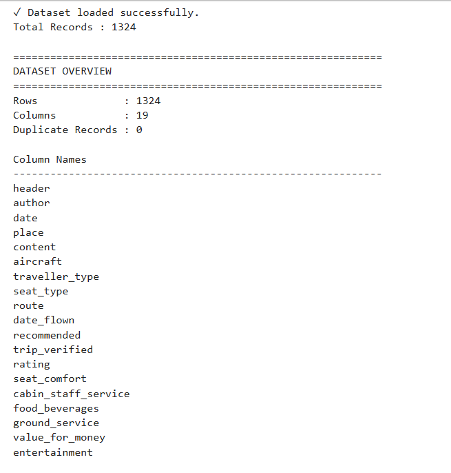

---

#  Step 2 — Initial Dataset Inspection

Before performing any analysis, the dataset was inspected to understand its structure.

The following checks were performed:

- Column names
- Data types
- Missing values
- Duplicate records

### Data Types (Before)

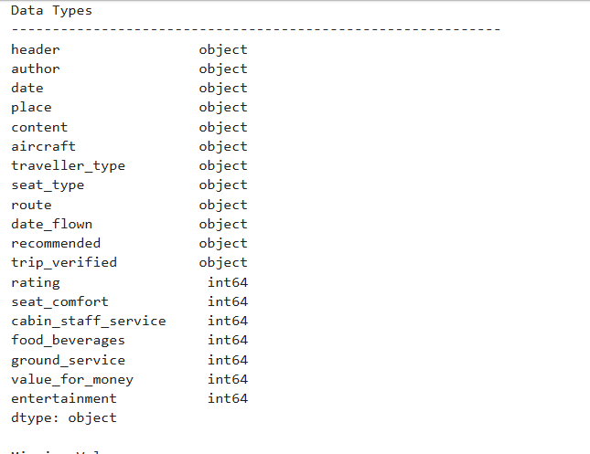

### Missing Values (Before)

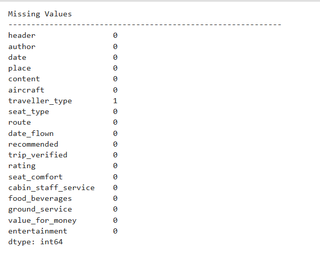

---

#  Step 3 — Key Column Validation

Important columns were inspected to understand their values before preprocessing.

The following columns were validated:

- `recommended`
- `trip_verified`
- `date`
- `date_flown`

This helped determine the required preprocessing steps.

### Screenshot

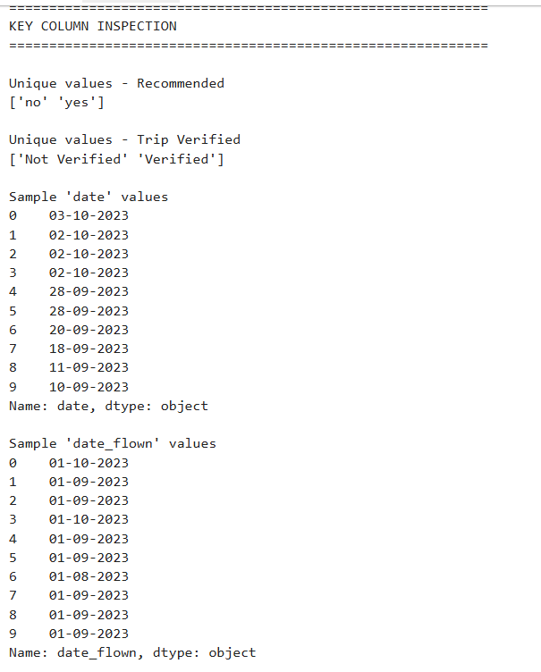

---

#  Step 4 — Data Preparation

The dataset was prepared for business analysis using the following transformations.

###  Date Conversion

- Converted `date` to **datetime**
- Converted `date_flown` to **datetime**

###  Recommendation Encoding

Converted:

- Yes → 1
- No → 0

for both:

- `recommended`
- `trip_verified`

###  Missing Value Handling

- Filled missing traveller types with **"Unknown"**

###  Numeric Validation

Verified that all service rating columns were stored as numeric values.

### Screenshot

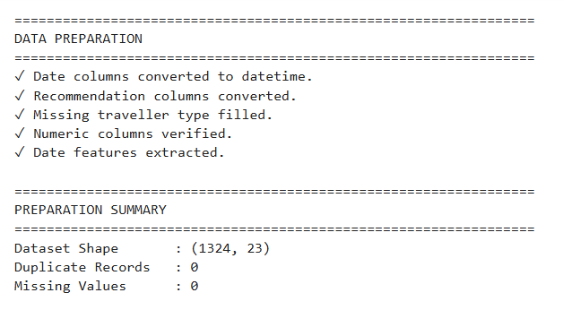

---

#  Step 5 — Dataset After Preparation

After preprocessing, the dataset became fully analysis-ready.

### Updated Data Types

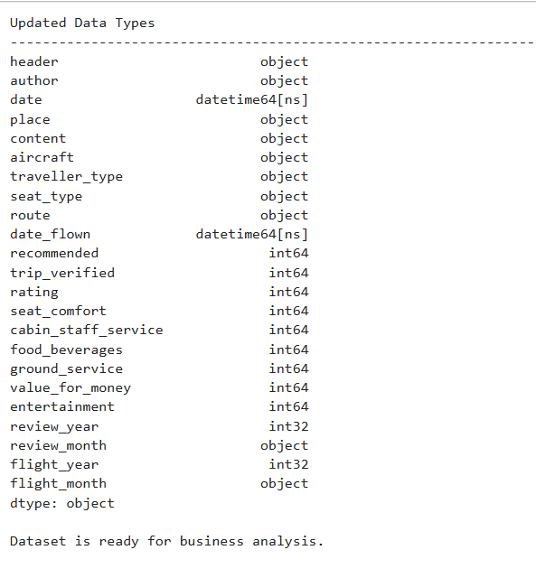

### Missing Values After Preparation

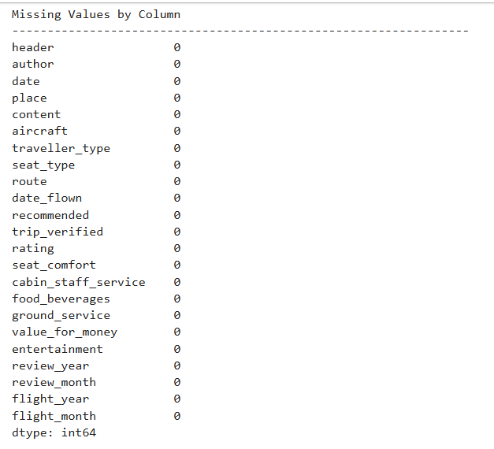

### Preparation Outcome

 Date columns converted

 Recommendation columns encoded

 Missing values handled

 Additional time-based features created

 Dataset ready for business analysis

---

#  Step 6 — Customer Satisfaction Overview

The project first generated high-level customer satisfaction metrics.

The following KPIs were calculated:

- Average Rating
- Median Rating
- Highest Rating
- Lowest Rating
- Recommendation Rate
- Verified Review Percentage

These KPIs provide a quick overview of passenger sentiment.

---

#  Step 7 — Traveller Type Analysis

Passenger reviews were grouped by traveller type to compare customer satisfaction.

Metrics analysed:

- Number of Reviews
- Average Rating
- Recommendation Rate
- Average Value for Money

### Screenshot

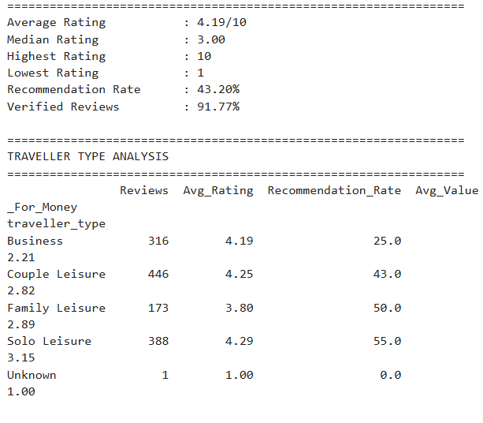

---

#  Step 8 — Seat Type Analysis

Seat categories were analysed to identify differences in passenger experience.

Metrics analysed:

- Average Rating
- Seat Comfort
- Recommendation Rate
- Value for Money

### Screenshot

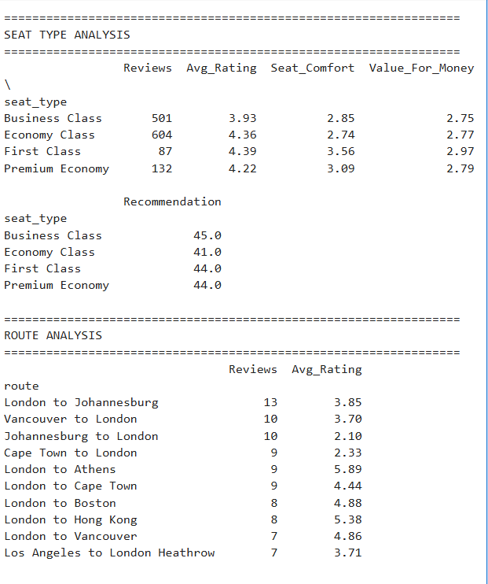

---

#  Step 9 — Monthly Review Trend

Passenger reviews were grouped by month and year to observe review activity over time.

The trend helps identify periods with higher customer engagement.

### Screenshot

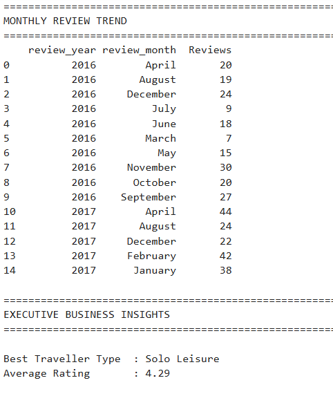

---

#  Step 10 — Executive Business Insights

Automated business insights were generated to summarize the most important findings.

The project identified:

- Best Traveller Type
- Lowest Rated Traveller Type
- Highest Rated Seat Type
- Highest Rated Aircraft
- Most Reviewed Routes
- Overall Service Ranking

### Screenshot

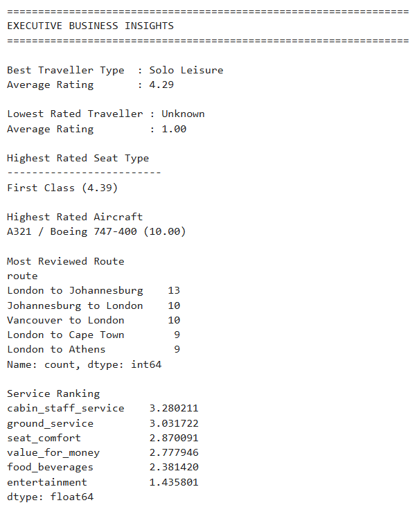

---

#  Step 11 — Top & Bottom Insights

The analysis summarized the strongest and weakest performing areas across the dataset.

This provides decision-makers with a quick overview of:

- Best performing customer segments
- Lowest performing segments
- Highest rated services
- Areas requiring improvement

### Screenshot

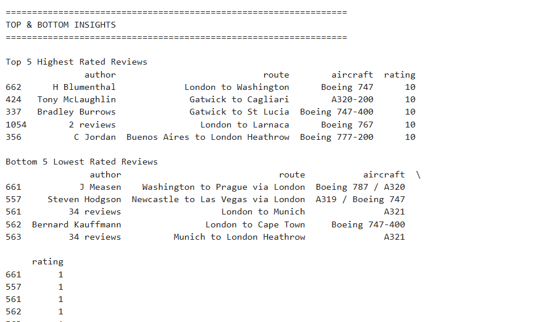

---

# Project Outcome

This project demonstrates a complete customer review analytics workflow using **Python** and **Pandas**.

The workflow included:

- Dataset inspection
- Data preparation
- Feature engineering
- GroupBy analysis
- Business KPI generation
- Trend analysis
- Executive reporting
- Automated business insights

The final result transforms raw airline passenger reviews into structured, business-ready insights that can support customer experience improvement and strategic decision-making.
