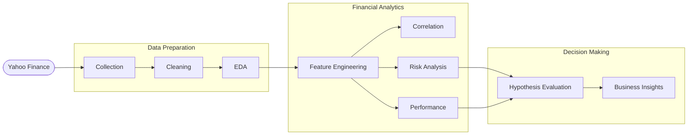
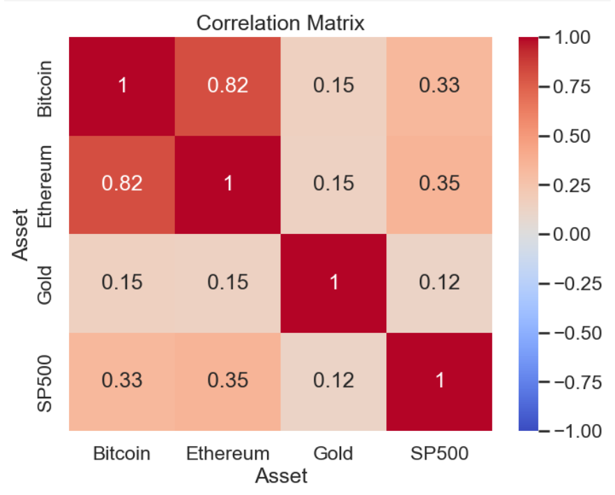
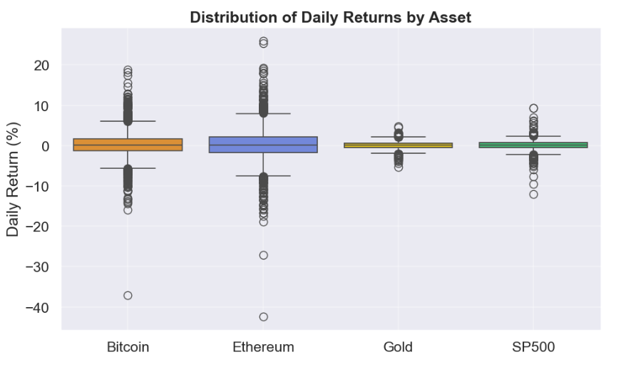
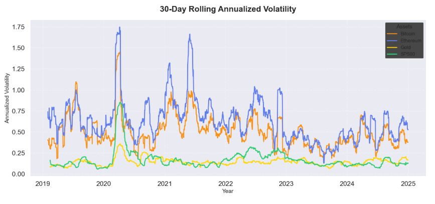
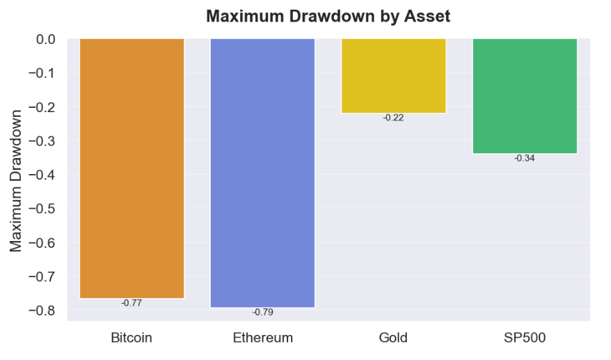
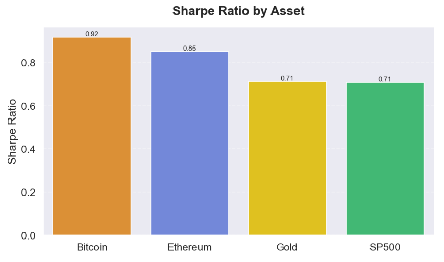
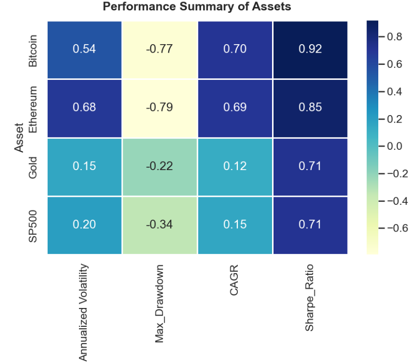

<p align="center">
  
</p>

---


---

#  Project Overview

Cryptocurrencies are often promoted as an alternative asset class capable of providing diversification from traditional financial markets. However, periods of global economic uncertainty have raised questions about whether digital assets continue to behave independently or increasingly move alongside conventional investments.

This project investigates the relationship between **Bitcoin**, **Ethereum**, **Gold**, and the **S&P 500 Index** using historical market data from **2019–2024**. Through financial analytics and statistical techniques, the study evaluates whether cryptocurrencies have decoupled from traditional financial markets.

#  Project Highlights

<p align="center">

|  Period | Assets |  Notebooks | Financial Metrics |
|:---------:|:--------:|:------------:|:-------------------:|
| 2019–2024 | 4 | 7 | 10+ |

</p>

---

#  Research Question

> **Has Cryptocurrency Decoupled from Traditional Financial Markets?**

---

#  Objectives

- Collect and prepare historical financial market data.
- Compare cryptocurrency and traditional asset performance.
- Analyze correlations between Bitcoin, Ethereum, Gold, and the S&P 500.
- Measure risk using volatility and maximum drawdown.
- Evaluate long-term investment performance using CAGR and Sharpe Ratio.
- Test research hypotheses using statistical analysis.

---

#  Research Hypotheses

### Hypothesis 1 – Market Relationship

**H₀₁:** There is no significant change in the relationship between cryptocurrencies and traditional financial assets.

**H₁₁:** The relationship between cryptocurrencies and traditional financial assets has changed significantly over time.

---

### Hypothesis 2 – Risk Characteristics

**H₀₂:** Cryptocurrencies exhibit risk characteristics similar to traditional financial assets.

**H₁₂:** Cryptocurrencies exhibit significantly higher risk than traditional financial assets.

---

### Hypothesis 3 – Investment Performance

**H₀₃:** Cryptocurrencies do not provide superior long-term risk-adjusted performance.

**H₁₃:** Cryptocurrencies provide superior long-term returns despite higher risk.

---

#  Dataset

**Source:** Yahoo Finance (`yfinance`)

### Assets

| Asset | Symbol |
|--------|--------|
| Bitcoin | BTC-USD |
| Ethereum | ETH-USD |
| Gold ETF | GLD |
| S&P 500 | ^GSPC |

**Study Period**

- January 2019
- December 2024

---

#  Technologies Used

- Python
- Pandas
- NumPy
- Matplotlib
- Seaborn
- SciPy
- Jupyter Notebook
- yfinance


---
#  Project Architecture


---
#  Financial Metrics Used

The following financial metrics were calculated throughout the analysis:

- Daily Returns
- Log Returns
- Cumulative Returns
- Rolling Mean
- Rolling Volatility
- Pearson Correlation
- Rolling Correlation
- Annualized Volatility
- Maximum Drawdown
- CAGR
- Sharpe Ratio

---

#  Project Visualizations

## Correlation Matrix

<p align="center">
  
</p>

---

## Distribution of Daily Returns
<p align="center">
  
</p>

---

## Rolling Annualized Volatility
<p align="center">
  
</p>

---

## Maximum Drawdown Comparison
<p align="center">
  
</p>

---
## Sharpe Ratio Comparison
<p align="center">
  
</p>

---

## Performance Summary
<p align="center">
  
</p>


---

#  Key Findings

- Cryptocurrencies exhibited substantially higher volatility than traditional financial assets.
- Bitcoin and Ethereum generated significantly higher cumulative returns over the study period.
- Gold demonstrated relatively stable price behaviour and lower drawdowns.
- Correlation between cryptocurrencies and traditional assets varied over time rather than remaining constant.
- Periods of market stress increased the relationship between cryptocurrencies and equity markets.

---

#  Business Insights

- Cryptocurrencies should not always be considered independent assets.
- Diversification benefits may decrease during periods of market uncertainty.
- Investors should evaluate both return potential and downside risk.
- Combining traditional assets with cryptocurrencies may improve long-term portfolio resilience.

---

#  How to Run the Project

Clone the repository

```bash
git clone https://github.com/Illakiya-B/python-data-analytics-/05.capstone-crypto-decoupling-analysis.git
```

Navigate to the project directory

```bash
cd 05.capstone-crypto-decoupling-analysis
```

Install dependencies

```bash
pip install -r requirements.txt
```

Launch Jupyter Notebook

```bash
jupyter notebook
```

Run the notebooks in numerical order.

---

#  Future Improvements

- Include additional cryptocurrencies such as Solana and BNB.
- Incorporate macroeconomic indicators (inflation, interest rates).
- Apply portfolio optimization techniques.
- Integrate sentiment analysis using financial news.
- Develop an interactive dashboard using Streamlit or Power BI.

---

#  Author

**Illakiya B**

M.Sc. Data Analytics  

---

#  License

This project is licensed under the MIT License.

---

⭐ If you found this project useful, consider giving the repository a star.
